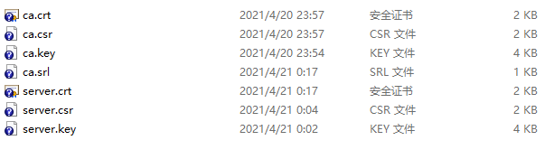

# 学习搭建本地HTTPS模拟api开发前端

假设您了解 1.mock.js 或者2. ajax insterceptor(生产环境mock返回值)。
现在，在前后端分离项目中，后端还没开发好时，需要前端开干。
假设您本地已安装node。

## 入门篇， 接收http get请求（如已了解-继续向下看看）
您是否知道：**node 搭建 http 服务？**
http.createServer
```
const http = require('http')

const server = http.createServer((req, res) => {
  res.writeHead(200)
  res.end('hello world\n')
})

server.listen(8080)

console.log('Server running at http://127.0.0.1:8080')
```
运行 `node demo/http_get.js`


## 加深篇 接收http post请求（如已了解-继续向下看看）
您是否知道：**node 解析 post 请求?**
接收请求流 on("data"), on("end")
```
var http = require("http");

http.createServer((request, response) => {
    request.on("data", function (data) {
    });
    request.on('end', function () {
        response.end('hello');
    });

}).listen(8081);

console.log('Server running at http://127.0.0.1:8081/');
```
运行`node demo/http_post.js`,访问一个能发送post请求的静态页面
 <a href="demo/http_post.html" target="__blank">demo/http_post.html</a>


## 入坑篇， 接收https get请求（如已了解-继续向下看看）
您是否知道：**node 搭建 https 服务？**
```
const https = require('https')

const fs = require('fs')
const path = require('path')

const options = {
  key: fs.readFileSync(path.join(__dirname, '../cert/server.key'), 'utf8'),
  cert: fs.readFileSync(path.join(__dirname, '../cert/server.crt'), 'utf8')
}

https.createServer(options, (req, res) => {
  res.writeHead(200)
  res.end('hello world\n')
}).listen(3000)

console.log('Server running at https://127.0.0.1:3000')
```
如无option参数, 直接请求，ERR_SSL_VERSION_OR_CIPHER_MISMATCH, **CA证书问题**

**划重点**，<span style="background-color: yellow;">本地openssl当作CA,给自己颁发一个免费证书自用。</span>
（windows的话，如果安装了git，用git bash窗口执行如下openssl命令）
`openssl genrsa -out ca.key 4096`
`openssl req -new -key ca.key -out ca.csr`
`openssl x509 -req -in ca.csr -signkey ca.key -out ca.crt`

`openssl genrsa -out server.key 4096`
`openssl req -new -out server.csr -key server.key`
`openssl x509 -req -in server.csr -CA ca.crt -CAkey ca.key -CAcreateserial -out server.crt`


生成如下证书文件（直接拷贝右键另存为[server.key](cert/server.key), [server.crt](cert/server.crt) ?）

 <a href="https://127.0.0.1:3000/" target="__blank">https://127.0.0.1:3000/</a>


## 附带 接收https post请求(可跳过)
```
const https = require('https')

const fs = require('fs')
const path = require('path')

const options = {
  key: fs.readFileSync(path.join(__dirname, '../cert/server.key'), 'utf8'),
  cert: fs.readFileSync(path.join(__dirname, '../cert/server.crt'), 'utf8')
}

https.createServer(options, (request, response) => {
    request.on("data", function (data) {
    });
    request.on('end', function () {
        response.end('hello https');
    });

}).listen(3001);

console.log('Server running at https://127.0.0.1:3001/');
```
运行`node demo/https_post.js`,
访问静态页面如 <a href="demo/https_post.html" target="__blank">demo/https_post.html</a>

## 继续填坑，偏后端（跨域问题和返回json）

待续...

test